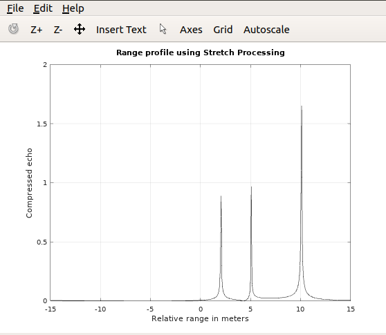
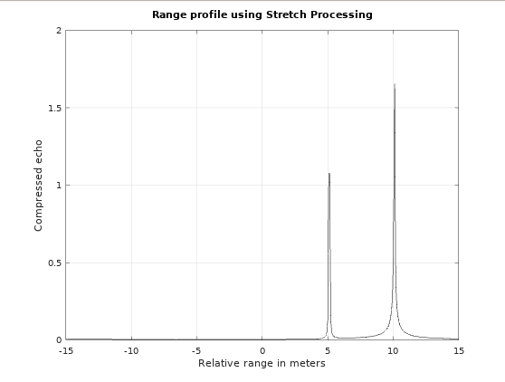

# This folder includes compression techniques for doppler processor to get the range-profile!

## Case 1: Pulse Compression in Correlation Processor (using matched filter)

### Algorithm:
    • Simulate the replica of transmitted signal (matched filter stores the delayed transmitted signal).  
    • Assume few targets and compute the received signal (y) 
    • Perform the cross correlation between the replica of transmitted signal and y.
    • The cross correlation reveals the positions of targets. (Range-Profile)

### Results:

Replica Generation (Chirp signal)

Simulate received signal assuming 3 targets. This provides an uncompressed output

Target detection using pulse compression (all 3 targets detected)

## Case 2: Pulse Compression using Stretch Processor

### Steps:

    • Assume the number of scatterers and simulate the received signal. Assume the replica signal and generate the mixer output (y).
    • Compute the range-profile using the Fast fourier transform on y. (Frequency domain)

Notice that the minimum frequency (frequency resolution) separation between the targets must be (2 * B * range_resolution / c * tau) to be resolved properly.

### Results:
1. Targets at [2,5,10], frequency resolution ~ 0.15. Targets are resolved properly!

2. Targets at [5,5.1,10], frequecy resolution ~ 0.15. Only 2 targets are detected!

Reference: Bassem R. Mahafza, Radar Signal Analyis and Processing using Matlab
