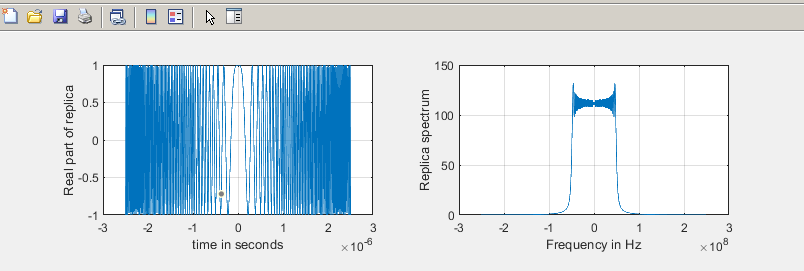
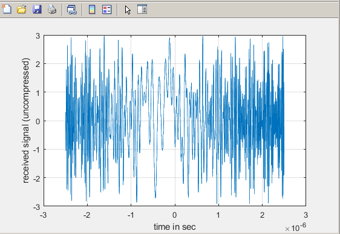
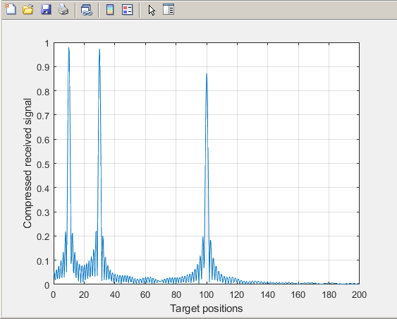

# This folder includes compression techniques for doppler processor to get the range-profile!

## Case 1: Pulse Compression in Correlation Processor (using matched filter)

### Algorithm:
    • Simulate the replica of transmitted signal (matched filter stores the delayed transmitted signal).  
    • Assume few targets and compute the received signal (y) 
    • Perform the cross correlation between the replica of transmitted signal and y.
    • The cross correlation reveals the positions of targets. (Range-Profile)

### Results:

Replica Generation (Chirp signal)

Simulate received signal assuming 3 targets. This provides an uncompressed output

Target detection using pulse compression (all 3 targets detected)

