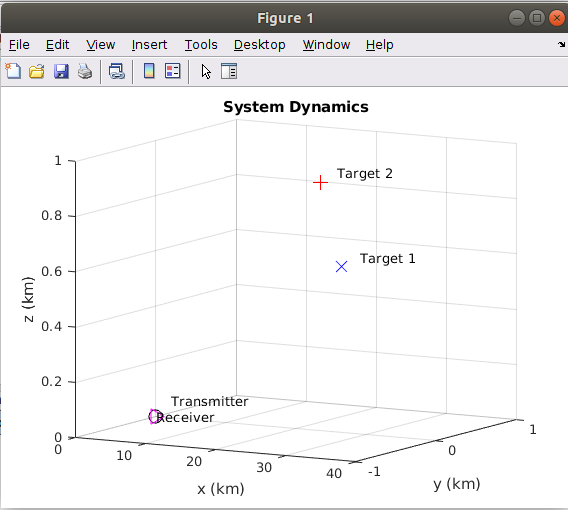
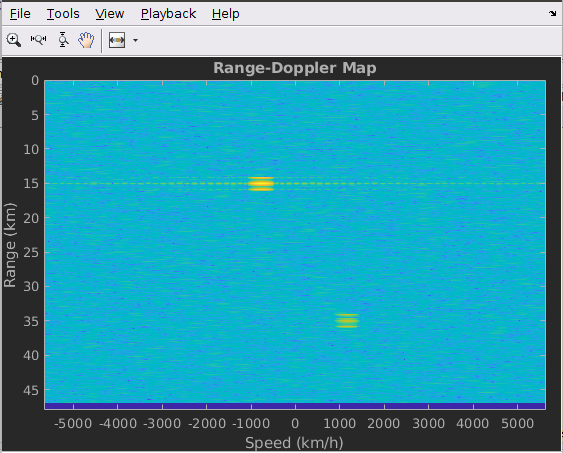
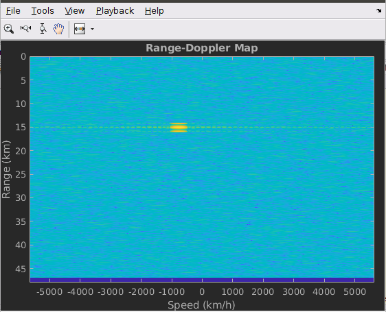

# Range-Doppler Map of a Polarimetric Radar

## System Specifications:
Carrier Frequency = 300 MHz  
Maximum Unambiguous Range = 48 km  
Range Resolution = 50 m  
Time- Bandwidth Product = 20  
Peak Transmitter Power = 2 kW  
Transmitter/ Receiver Gain = 20 dB  

## Radar Blocks:
### Antenna:
1. Consider a short dipole antenna as both transmitting and receiving antenna.
2. Antenna is located at origin [0;0;0]
3. Assume both Tx and Rx antenna transmits/receives vertically polarized elements.
### Target: Assume two targets in space.
Target – 1: Located at [15000;1000;500] meters away from the antenna and is moving at a velocity of [100;100;0] m/s.  
Target – 2: Located at [35000;-1000;1000] meters away from the antenna and is moving at a velocity of [-160;0;-50] m/s.
### Radar Pulse Synthesis:
1. Simulate signal propagation of Linear FM waveform towards target
2. Update the positions of target as seen by the transmitter
3. Reflect pulse off of targets and capture the received signal

## Range Doppler Map
1. Get the reference signal (ideally delayed replica of transmitted waveform)
2. Use the matlab built-in function “phased.RangeDopplerResponse” on the reference and received signal.  
Range FFT Length : 1024 (fast time fft for range information)  
Doppler FFT Length: 512 (slow time fft for doppler information)  
3. Plot the results.

## Simultion results:

 
  Case 1:  
Both targets preserve Polarization. Therefore, Range Doppler Map captures both the targets (Target-1 at ~15km and Target-2 at ~35 km)  
  

  Case 2:
Target – 2 flips the polarization, while Target – 1 preserves polarization. Therefore, Range Doppler Map captures only one target (Target-1 at ~15km).  

